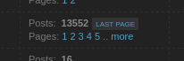
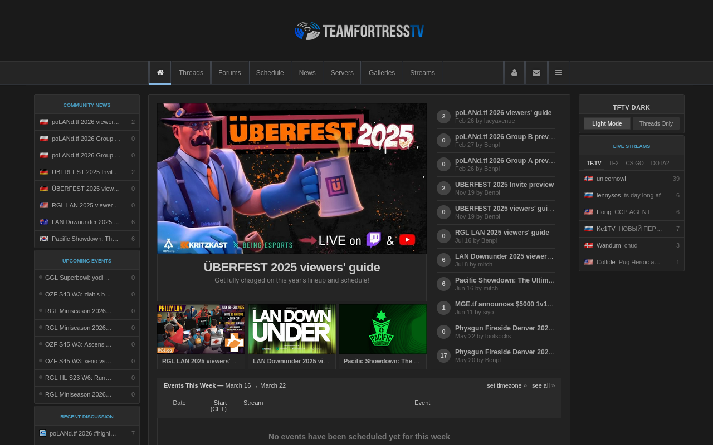
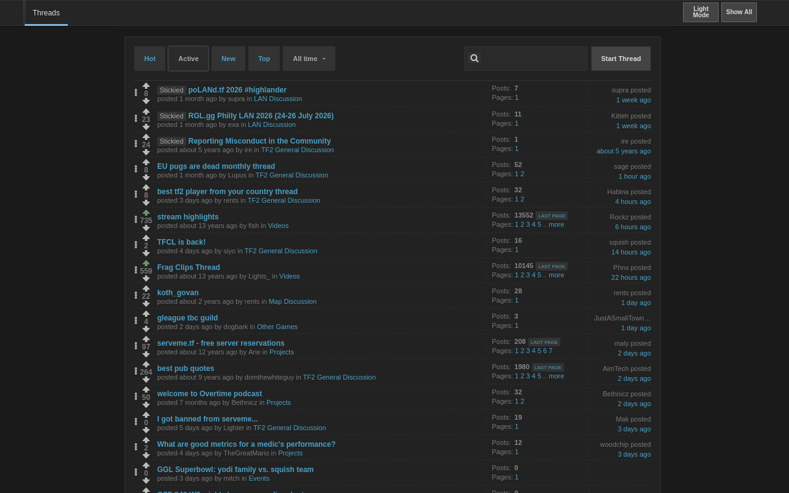
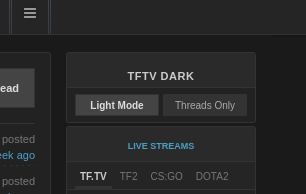

# TFTV Dark

A browser extension that adds dark mode and a "Threads Only" mode to [teamfortress.tv](https://www.teamfortress.tv/).

## Features

- **Dark Mode** - Greyscale dark theme, can be toggled on/off.
- **Threads Only Mode** - Strips the site down to just the thread list.
- **Last Page Button** - Threads with 5+ pages get a "Last Page" shortcut.

  

- **Empty Page Redirect** - Automatically redirects empty thread pages to the real last page.

## Screenshots

## Installation

- **Firefox** — [Install from Firefox Add-ons](#) *(link coming soon)*
- **Chrome** — [Install from Chrome Web Store](#) *(link coming soon)*

## Usage

Once installed, visit [teamfortress.tv](https://www.teamfortress.tv/). You'll find a **TFTV Dark** control panel in the right sidebar (above Live Streams) with two buttons:

- **Dark Mode / Light Mode** - Toggle the dark theme (on by default)
- **Threads Only / Show All** - Toggle the minimal threads-only view

## License

MIT
